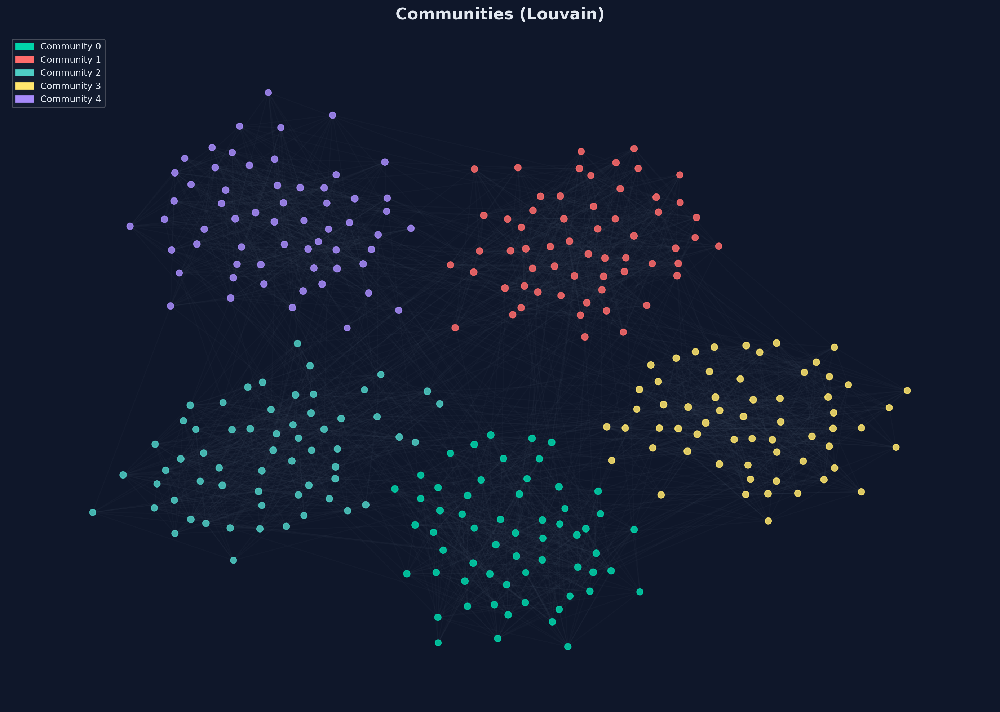
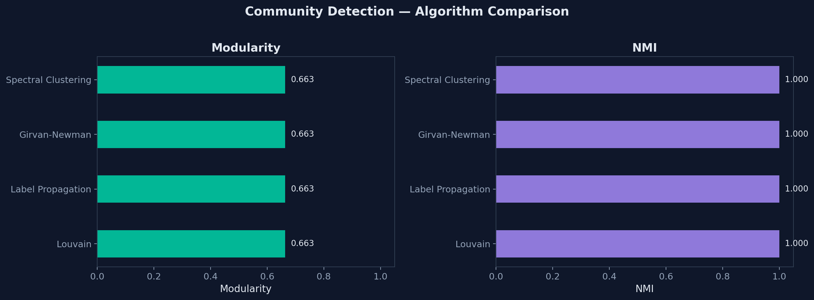
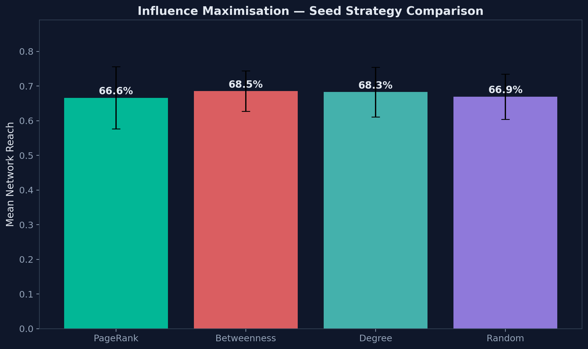
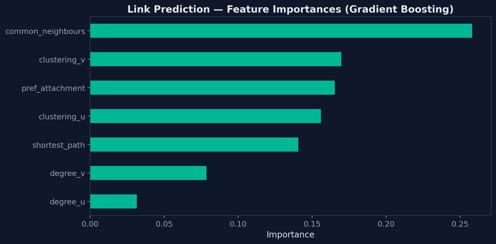

# Network Analysis Toolkit

This project explores social network structure with community detection, centrality, influence spread, and link prediction.

It includes a command-line pipeline, a notebook walkthrough, reusable modules, and generated plots from synthetic and small benchmark-style graphs.

<p align="center">
  
</p>

## What is included

- Graph generation for SBM, LFR, and small named datasets
- Community detection with Louvain, label propagation, Girvan-Newman, and spectral clustering
- Centrality analysis with degree, betweenness, eigenvector, and PageRank
- Independent Cascade influence simulations
- Link prediction with heuristics and gradient boosting
- Plotting utilities for distributions, comparisons, and communities

## Key outputs

| Area | Output |
| --- | --- |
| Community detection | Modularity and NMI comparisons |
| Centrality | Correlation and distribution plots |
| Influence spread | Seed strategy comparison |
| Link prediction | Heuristic and ML baseline metrics |

## Quick start

```bash
pip install -r requirements.txt
python main.py --dataset sbm --nodes 300
```

Other examples:

```bash
python main.py --dataset lfr --nodes 500
python main.py --dataset karate
```

## Repository map

```text
main.py                         End-to-end CLI pipeline
src/network_builder.py          Graph construction
src/community_detection.py      Community algorithms
src/influence_analysis.py       Centrality and spread simulation
src/link_prediction.py          Link prediction features and models
src/visualisation.py            Plot generation
notebooks/analysis.ipynb        Interactive walkthrough
outputs/                        Generated figures
```

## Sample figures

<p align="center">
  
  <br><em>Community detection comparison</em>
</p>

<p align="center">
  
  <br><em>Influence seed strategy comparison</em>
</p>

<p align="center">
  
  <br><em>Link prediction feature importance</em>
</p>
